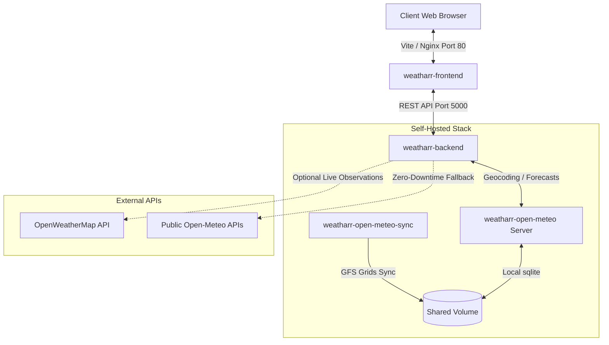

# Weatharr 🌦️

[](https://opensource.org/licenses/MIT)
[](https://www.docker.com/)
[](https://react.dev/)
[](https://vitejs.dev/)

Weatharr is a premium, self-hosted, highly customizable weather dashboard. Built using a modern **dark glassmorphism design system**, it offers a layout engine powered by `react-grid-layout`, advanced SVG observation sparklines, multi-location tab hub navigation, and unique hybrid data layers combining local GFS weather model grids with live OpenWeatherMap API metrics.


---


## 🌟 Key Features

*   🔮 **Premium Glassmorphism Aesthetics**: Fully customized CSS tokens detailing high-contrast transparency layers, custom focus glows, and smooth responsive transitions.
*   📐 **Draggable & Resizable Grid Layouts**: Customize card positions and sizes directly on the dashboard screen, and lock the canvas layout when satisfied.
*   ⚡ **Smart Packing Algorithms**:
    *   **Dense Grid Pack**: Instantly align widgets into their minimum optimal footprint.
    *   **Portrait Stack (9:16)**: Stack widgets vertically for smartphones or small touch monitors.
*   💾 **Layout Profiles Database**: Save and load multiple layout configurations directly from your self-hosted backend.
*   🌐 **Multi-Location Hub**: Open several location tabs to track different cities, with state changes mapped directly to SEO-friendly URL slugs (e.g., `/london`, `/new-york`) for easy bookmarking.
*   🔒 **Secure Admin Lock PIN**: Protect your dashboard design and credential entries from tampering by specifying an `ADMIN_PIN` in the server environment. Viewers can browse freely, while modifications require verification.
*   🔋 **Server-Shielded Observations**: Input your personal OpenWeatherMap API key to upgrade weather forecasts with live measurements. The key is masked (`••••••••`) inside API responses and resolved server-side, preventing leakage in browser query parameters or console logs.
*   🔌 **Zero-Downtime Fallback**: If the local Open-Meteo database goes offline, updates, or fails, the proxy engine transparently routes traffic to the public `api.open-meteo.com` endpoint automatically.
*   📈 **Hourly SVG Charts**: Customized responsive SVG graphs displaying Temperature, Rain, UV, and Wind on a normalized scale, featuring synchronized tooltips and a real-time daylight tracker.
*   📉 **144-Hour Barometric Sparkline**: Trace pressure patterns up to 72 hours in the past and 72 hours into the forecast.
*   🌫️ **Layman-Translated AQI**: Understand particulate indices (PM2.5, PM10, Ozone, NO2) through clear, easy-to-read health guidance terms.
*   📤 **JSON Setup Sharing**: Export your entire dashboard configuration (widgets, locations, fonts, units, API keys) as a JSON string to copy, share, or import on another browser.

---

## 🏗️ Architecture Overview

The system consists of four microservices orchestrated via Docker Compose:



---

## 🚀 Self-Hosting Guide (Quick Start)

To deploy Weatharr in your own environment, follow these steps:

### 1. Create a `docker-compose.yml` File
Paste the following configuration into a new directory:

```yaml
services:
  weatharr:
    # Pull pre-built multi-arch image from GHCR
    image: ghcr.io/thesuperben/weatharr:latest
    container_name: weatharr-app
    ports:
      - "58080:5000" # Map host port 58080 to Express container port 5000 (serves both React app & APIs)
    environment:
      - PORT=5000
      - NODE_ENV=production
      - TZ=UTC # Force container timezone (e.g. Europe/London, America/New_York, or Australia/Adelaide)
      - ADMIN_PIN=1234 # Set a numerical PIN or secure password to lock layouts/settings modifications. Leave empty to disable protection.
      - CONFIG_PATH=/app/data/weatharr_config.json
      - PROFILES_PATH=/app/data/weatharr_profiles.json
      - OPEN_METEO_URL=http://open-meteo:8080/v1/forecast
      - AIR_QUALITY_URL=http://open-meteo:8080/v1/air-quality
      - GEOCODING_URL=https://geocoding-api.open-meteo.com/v1/search
    volumes:
      - ./data:/app/data # Persists your dashboard configs, tabs, & API key
    restart: unless-stopped
    depends_on:
      - open-meteo

  open-meteo:
    image: ghcr.io/open-meteo/open-meteo
    container_name: weatharr-open-meteo
    command: ["serve", "--hostname", "0.0.0.0", "--port", "8080"]
    expose:
      - "8080"
    environment:
      - TZ=UTC # Enforce local server container timezone
    volumes:
      - open-meteo-data:/app/data
    restart: unless-stopped

  open-meteo-sync:
    image: ghcr.io/open-meteo/open-meteo
    container_name: weatharr-open-meteo-sync
    entrypoint: ["/bin/sh", "-c"]
    command:
      - |
        while true; do
          for model in $$(echo $$WEATHER_MODELS | tr ',' ' '); do
            echo "=== Syncing weather model: $$model ==="
            open-meteo sync "$$model" temperature_2m,relative_humidity_2m
          done
          echo "=== Sync cycle complete. Sleeping for 3 hours ==="
          sleep 10800
        done
    environment:
      - TZ=UTC # Enforce sync engine container timezone
      # List of weather models to sync. Copy/Paste relevant models into -WEATHER_MODELS comma separated. (e.g. WEATHER_MODELS="ncep_gfs013,ecmwf_ifs025,dwd_icon_eu,bom_access_c,jma_msm")
      # Recommended models by continent/region:
      # - Global: ncep_gfs013 (default), ecmwf_ifs025
      # - North America: ncep_hrrr_conus_15min (USA 3km), cmc_gem_hrdeps (Canada 2.5km)
      # - Europe: dwd_icon_eu (Europe 7km), meteofrance_arome_france0025 (France 2.5km)
      # - Australia: bom_access_c (Cities 1.5km), bom_access_global (12km)
      # - Asia: jma_msm (Japan 5km), kma_ldps (South Korea 1.5km)
      - WEATHER_MODELS=ncep_gfs013
    volumes:
      - open-meteo-data:/app/data
    restart: unless-stopped
    depends_on:
      - open-meteo

volumes:
  open-meteo-data:
```

### 2. Launch the Stack
Run the following command in the same directory:
```bash
docker-compose up -d
```

### 3. Open the Dashboard
Navigate to `http://localhost:58080` (or your host IP:58080) in your browser.

---

## ⚙️ Configuration & Environment Variables

The Weatharr Backend server and auxiliary services can be configured using these environment variables:

| Variable | Description | Default |
| :--- | :--- | :--- |
| `PORT` | Listening port for the backend service | `5000` |
| `NODE_ENV` | Mode for Express ('production' or 'development') | `production` |
| `ADMIN_PIN` | Secure lockout PIN to restrict dashboard edits | _None (Unprotected)_ |
| `TZ` | Timezone enforcement in container logs/systems | `UTC` |
| `WEATHER_MODELS` | Comma-separated array of models to sync in open-meteo-sync | `ncep_gfs013` |
| `CONFIG_PATH` | File path where client setups are persisted | `/app/data/weatharr_config.json` |
| `OPEN_METEO_URL` | Local or public Open-Meteo forecasting endpoint | `http://open-meteo:8080/v1/forecast` |
| `AIR_QUALITY_URL`| Local or public Open-Meteo air quality endpoint | `http://open-meteo:8080/v1/air-quality` |
| `GEOCODING_URL`  | Geocoding lookup provider URL | `https://geocoding-api.open-meteo.com/v1/search` |

### 🌍 Recommended Weather Models by Continent
To optimize forecasts, configure `WEATHER_MODELS` with the corresponding model keys:

*   **Global Baseline Models**:
    *   `ncep_gfs013` (Global GFS 13km - default baseline)
    *   `ncep_gfs025` (Global GFS 25km)
    *   `ncep_gfs050` (Global GFS 50km)
*   **North America (US & Canada)**:
    *   `ncep_hrrr_conus_15min` (CONUS high-res 3km, 15-minute intervals)
    *   `ncep_hrrr_alaska` (Alaska regional high-res 3km)
    *   `cmc_gem_gdps` (CMC Canada global baseline 15km)
    *   `cmc_gem_rdps` (CMC North America regional 10km)
    *   `cmc_gem_hrdeps` (Canada local high-res 2.5km)
*   **Europe**:
    *   `ecmwf_ifs025` (ECMWF global benchmark 25km)
    *   `ecmwf_ifs04` (ECMWF global low-res 40km)
    *   `ecmwf_aifs025` (ECMWF Global AI model 25km)
    *   `dwd_icon` (German global ICON baseline 13km)
    *   `dwd_icon_eu` (European regional ICON 7km)
    *   `dwd_icon_d2` (Germany local high-res 2.2km)
    *   `meteofrance_arome_france0025` (Météo-France high-res 2.5km)
    *   `meteofrance_arpege_europe` (Météo-France Europe regional 10km)
    *   `meteofrance_arpege_world025` (Météo-France global baseline 25km)
*   **Australia & Oceania**:
    *   `bom_access_global` (BOM ACCESS-G global baseline 12km)
    *   `bom_access_c` (Australian cities local high-res 1.5km)
*   **Asia**:
    *   `jma_gsm` (Japan global baseline 20km)
    *   `jma_msm` (Japan local high-res 5km)
    *   `kma_gdps` (KMA South Korea global baseline 12km)
    *   `kma_ldps` (South Korea local high-res 1.5km)

---

## 📡 IoT & E-Ink Displays (Magic Mirrors)

Because the self-hosted backend acts as a high-performance proxy and cache layer, it is ideal for feeding low-power, low-refresh auxiliary hardware (such as ESP32 e-ink panels, home dashboard tablets, or Magic Mirror modules):

*   **Clean JSON Data Access**: Query `/api/weather` and `/api/air_quality` directly from local devices. 
*   **CORS & Auth Bypassed**: Upstream queries bypass CORS blocks and require no request authorization, simplifying lightweight curl/HTTP queries on microcontrollers.
*   **Key Shielding**: Your OpenWeatherMap credentials remain hidden inside backend memory, removing any risk of exposing plain text keys inside client/firmware code.
*   **Built-in Caching**: Local caching rules (15-minute intervals) safeguard external API quotas if multiple auxiliary screens call the dashboard concurrently.

---

## 🔧 Developer Setup (Local Building)

If you wish to modify the application, run code locally, or build your own Docker images from source:

### Clone the Repository
```bash
git clone https://github.com/your-username/Weatharr.git
cd Weatharr
```

### Run Frontend in Dev Mode
```bash
cd frontend
npm install
npm run dev
```
The frontend dev server defaults to `http://localhost:5173`. Add your proxy redirects inside `vite.config.js` to route `/api/*` and `/v1/*` requests to port `5000`.

### Run Backend in Dev Mode
```bash
cd backend
npm install
npm start
```
The backend server listens on `http://localhost:5000`.

### Build with Local Source
To rebuild your custom images using docker-compose:
```bash
docker-compose -f docker-compose.yml up -d --build
```

---

## 📝 License

Distributed under the MIT License. See [LICENSE](file:///w:/Weatharr/LICENSE) for more details.
